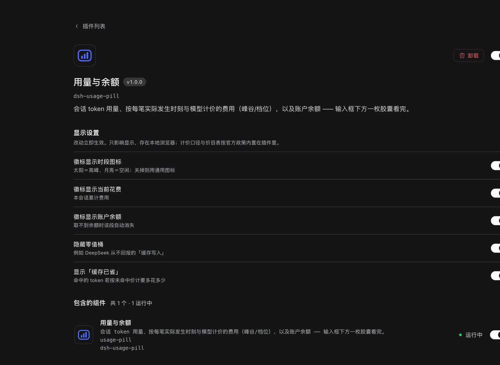
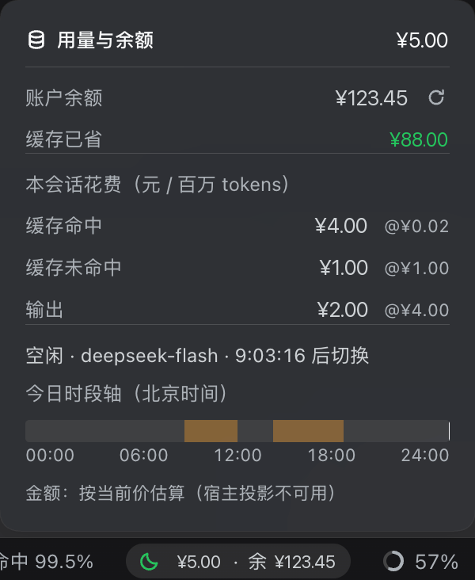

# dsh-usage-pill 🧮

> **English quick start** — A DSH plugin that shows session **token usage**, **cost priced
> at each request's own time and model** (peak/off-peak, per model tier), and your
> **account balance** in one pill below the composer. It needs **no API key** when you are
> signed in to a DeepSeek account (it reads the account balance through the harness's own
> account remote, falling back to `DEEPSEEK_API_KEY`). It is a single-file client bundle
> with a dependency-free host half, and ships 49 assertions (`npm test`). MIT licensed.
> Install: `plugin_manager(action: "install_bundle", target: "github:oliblue-evan/dsh-usage-pill")`, then
> reload the page.


DeepSeek **用量与余额**：输入框下方一枚徽标，实时显示本会话的 token 用量、按峰谷与
模型档位换算的人民币费用，以及账户余额。点开是四桶明细与计价口径。

> **和同类插件最不一样的一点：查余额不需要 API Key。**
> 已登录 DeepSeek 账号的用户走宿主自己的账号授权（`ctx.remote.account.getBalance`），
> 密钥全程不出现；只有「没登录、只有 API Key」的用户才回落到宿主路由。
> 据我看到的同类插件，真实余额普遍要求你自行配置 API Key。

## 截图

**插件页** —— 标题、简介与图标按官方约定提供（`package.json` 的 `icon` + `locale/*.json` 的
`meta.title` / `meta.description`），栏目位置由 `plugins.bundle.config` 槽位决定：



**弹层与胶囊** —— 输入框下方那枚胶囊，点开是明细、计价口径、峰谷倒计时与今日时段轴：



> 两张截图里的**金额、余额、token 数均为示例值**（真实数值已做打码处理）；第二张底部显示
> 「按当前价估算」是宿主投影尚未加载时的降级提示，属预期行为，见下文「金额口径」。

```text
🧮 108.0k tok · ¥0.05 · 余 ¥123.45
```

## 它和别家有什么不同

写之前把 GitHub 上同类插件翻了一遍（[dsh-token-billing](https://github.com/2006spy/dsh-token-billing)、
[DSH-TOKEN-feiyong](https://github.com/singei8/DSH-TOKEN-feiyong)、
[dsh-balance-stats](https://github.com/hhy66/dsh-balance-stats)、
[dsh-plugin-balance](https://github.com/Utmotc/dsh-plugin-balance)、
[dsh-deepseek-balance](https://github.com/Bob-Bo1/dsh-deepseek-balance)、
[dsh-usage-balance](https://www.npmjs.com/package/dsh-usage-balance) 等）。
这批里功能最全的 `dsh-token-billing` 做得非常猛（仪表盘、预算、按路由计价、CSV 导出、
206 项测试），但它的兼容范围写的是 `dsh <0.2.0`，而本机是 `0.2.0-rc.2`，装不上。
本插件借了它的几个关键思路，但**刻意做小**：

| | 同类插件常见做法 | 本插件 |
|---|---|---|
| token 用量来源 | 自己监听 `session/event` 折叠 + 持久化账本 | **读 DSH 自带的 `tokenUsage` 投影**（宿主已折叠好的响应式数据） |
| 轮询 | 定时轮询宿主接口 | **零轮询**：用量随投影自动更新；余额只在挂载时取一次 |
| 历史/今日统计 | 700+ 行账本 + 启动全量扫盘 | 不做（见下方"已知取舍"） |
| 余额 | 有的用 PowerShell 调接口 | **账号优先**：走你已登录的授权；只有 API Key 的用户自动兜底 |
| 体积 | 数 MB 起 | 约 30 KB，无构建步骤 |

**价格表与时间线**：本插件内置的价目与 `dsh-token-billing` 的内置表**逐位一致** ——
flash 空闲 `0.02/1/4`、高峰 `0.04/2/8`；pro 空闲 `0.15/4.5/13.5`、高峰 `0.3/9/27`；
生效时刻也一致（2026-08-17 00:00 北京时间峰谷起点、2026-09-10 12:00 flash 调价）。
两个独立实现互相印证，这表可以信；官方再调价时改 `client.js` 顶部即可。

## 余额从哪来（账号登录不需要 API Key）

**主路径 —— 已登录的账号授权。** DSH 的账号平台自带 `getBalance`：它用保存的授权 token
（`x-dsh-auth-token` 头）请求 `platform.deepseek.com`，并投影出 `normal_wallets` / `bonus_wallets`
的币种与余额。官方「设置 → 账号」页读的就是这条链路，本插件**复用同一条**：

```js
ctx.remote.account.getBalance({
  version: '0.2.0-rc.2',
  locale: <当前语言>,
  timezoneOffsetSeconds: -new Date().getTimezoneOffset() * 60,
})
```

返回 `{ status:'ready', value: 充值钱包[], bonusWallets: 赠金钱包[] }`。授权 token 全程留在
宿主进程，浏览器只拿到余额数字；未登录时返回 `null`。

**兜底路径 —— 只有 API Key 的用户。** 账号返回 null 时回落到宿主路由
（`credentials.resolve('DEEPSEEK_API_KEY')` + 宿主 `fetch` 官方 `/user/balance`，
60 秒缓存、密钥不下发浏览器、错误按 `sk-` 脱敏）。

两条路径在面板里都标注来源（`账号` / `API Key`），都拿不到就如实说明原因，不编数字。

## 金额口径（这一节最重要）

显示的费用有**两种来源**，面板底部会写明当前用的是哪一种，绝不让估算冒充账单：

| 来源 | 何时使用 | 含义 |
|---|---|---|
| **实际发生额** | 宿主 `usagePillCost` 投影可用时（正常情况） | 每笔用量按**它自己那一刻**的峰谷、**它当时那个模型**计价后累加 |
| 按当前价估算 | 宿主投影不可用时（宿主未重启、投影被禁用） | 用累计四桶 × 此刻的价 × 此刻的时段反推，会在面板里标明「按当前价估算」 |
| — | 连 `tokenUsage` 都拿不到 | 显示破折号，而不是 `¥0`（`¥0` 会被读成"免费"） |

**为什么不能只靠累计四桶算**：浏览器读到的 `tokenUsage` 投影只有累计值，没有"这一笔是什么时候、
什么模型花的"。用累计 × 当前价 × 当前时刻会犯两个错：

- **跨过峰谷边界后，历史花费被追溯改写** —— 高峰时段烧的那部分，到了空闲时段再看就按便宜价算了；
- **会话中途换模型后，整段历史按新档位计价** —— pro 的未命中价是 flash 的 4.5 倍。

所以宿主注册了一个 `usagePillCost` 会话投影（`lib/cost-projection.js` + `lib/cost-fold.js`），
折叠每条 `assistant/message` / `assistant/attempt`：**模型**取自它前面那条 `request/header`，
**时刻**取事件自身的 `time`。折叠口径与官方 `tokenUsage` 投影一致（同一 turn+step 后到替换先到），
并且 `llm/retry-started` 之后的重试**累加**（那是另一次真实计费调用）。

```text
费用 = 未缓存输入×miss + 缓存读×hit + 缓存写×miss + 输出×out   （单位：元 / 百万 token）
```

- **峰谷**：高峰 = 北京时间周一至周五 09:00–12:00、14:00–18:00（左闭右开），
  高峰期单价 ×2；**周末与中国法定节假日整天按空闲计价**（官方按 UTC 判工作日，
  所以调休补班的周六仍算周末）。
- **档位**：模型名含 `flash` 走 flash 价，其余走 pro 价；面板里显示**真实模型 id**，
  识别不到时会明说「未识别到模型 · 按 pro 档计」，而不是给一句确信的档位。
- **价格政策时间线**：按用量发生的时刻取段，历史回看不被新规追溯改写。
- 「缓存已省」= 命中的 token 若按未命中价计要多花的钱（按当前价算，面板里注明）。

### 为什么「缓存写入」对 DeepSeek 永远是 0

**因为 DeepSeek 没有这个概念。** 它的上下文缓存是**服务端自动**完成的：把前缀写进缓存
不额外收费、也从不回报，API 只给 `prompt_cache_hit_tokens` / `prompt_cache_miss_tokens`。
harness 的 `TokenUsage` 是**provider 无关**的，里面那个 `cacheWriteTokens` 取自
provider 适配器这一行：

```js
const cacheWriteTokens = rawUsage.prompt_tokens_details?.cache_write_tokens || 0;
```

`cache_write_tokens` 是 OpenAI / Anthropic 那套**显式缓存**的字段（手动打 cache 断点、
按更高价买一次"写入"），DeepSeek 不返回它。

所以面板**不写死"隐藏这一行"**，而是按数据判定：**某个桶的 token 与金额都为 0 就隐藏**
（`client.js` 的 `visibleRows`）。将来遇到真会回报缓存写入的 provider，那一行会自动回来。
四个桶全为 0 时显示「本会话暂无用量」，而不是留四行 ¥0。

## 界面

**视觉与宿主原生弹层一致**：结构与样式抄自 DSH 自带的会话统计弹层
（`@deepseek-ai/dsh-client-ui-chat` 的 `StatsPills.module.css` 与 `stat-dialog.module.css`），
类名用 `um` 前缀（避免与页面上其它插件冲突），只引用 `--dsw-*` token。

- **徽标**：`[🌙] ¥5.00 · 余 ¥123.45` —— 三段各说一件事，没有冗余：
  - **前置图标即时段**：☀ 太阳＝高峰（琥珀）、🌙 月亮＝空闲（绿）。峰谷状态一眼可见，
    不必再占一段文字。
  - **当前花费**：宿主自带的统计胶囊只报 token，不报钱。
  - **账户余额**：界面上其它地方都没有的数字。
  token 用量刻意**不放**在徽标上（宿主的统计胶囊已经显示了，重复没意义），它只出现在面板里。
  样式与旁边宿主的统计胶囊同一套（无边框透明胶囊、`label-tertiary`、hover 上底色）；
  余额尚未取到时该段自动消失，徽标退化成 `[🌙] ¥5.00`，不占空位。
- **面板**（`createPortal` 挂 body + `position:fixed`，不会被输入框容器裁掉；
  上方放不下自动翻到下方，滚动/缩放跟随，点外面或 Esc 收起）。
  **版式沿用宿主统计弹层的 `dt/dd` 两列**（不另造三列表 —— 中间那列空档会把视线拉散，
  还带出表格的厚重感），四组用细分隔线隔开：
  1. **概览**：`账户余额 ¥123.45（含赠送 ¥20.00）` + 一枚自绘的 ⟳ 刷新；
     `缓存已省 ¥88.00`（用 success 色，这是好消息）
  2. **本会话花费**（标题带单位 `元 / 百万 tokens`）：四行 `缓存命中 / 未命中 / 写入 / 输出`，
     每行是 `金额 @单价` —— **单价贴在它自己那行**（`¥4.00 @¥0.02`），既不用三列表，
     也不会像脚注那样被忽略；精确 token 数进 tooltip（正文放 `200,000,000 tok` 只会抢视线）
  3. **时段**：一行说清「现在什么价、还能用多久」：`空闲 · deepseek-flash · 10:34:31 后切换`
     （倒计时部分自带 1 秒刷新；高峰时才追加 `· 高峰 ×2`，空闲时不显示 `×1` 这种噪声）；
     下面接今日时段轴
- **只在异常时才解释**：金额口径只有在「宿主投影不可用、金额是按当前价估算」时才占一行；
  正常（逐笔实际计价）时口径说明只进总额的 tooltip。
- 中英文走 Client locale 服务；金额一分钱以上给两位小数（`¥0.85` 而不是 `¥0.8496`），
  不足一分才用 4 位（避免显示成 `¥0`）。
- 计时很克制：倒计时单独成组件、只有它每秒刷新；面板其余部分 30 秒对齐一次峰谷；
  页面在后台暂停。

> 时段判定、价目表、时段轴原先在独立的 `peak-valley` 插件里，现已合并进本插件，
> 后者已删除 —— 一枚胶囊说清用量、费用、余额、当前时段与今日时段轴。

## 文件

| 文件 | 作用 |
|---|---|
| `package.json` | bundle 清单（`dsh.bundle.patch` + `dsh.client`） |
| `cordis.patch.yml` | 组合层，插入一行 `usage-pill` |
| `index.js` | 宿主半边：注册 `usagePillCost` 投影 + 条件注册余额路由（同源校验、60 秒缓存、密钥脱敏） |
| `lib/pricing.js` | 宿主计价内核（价目表、峰谷判定、桶映射、单笔计价、事件取用量） |
| `lib/cost-fold.js` | 投影的**纯折叠逻辑**（可被普通 node 进程单测） |
| `lib/schema.js` | 自带的最小结构校验器，**替代 zod**（原因见下） |
| `lib/cost-projection.js` | 投影接线层（schema + `ctx.sessionProjections.register`） |
| `client.js` | 全部界面：读投影、余额双链路、徽标与弹层 |
| `locale/en.json`、`locale/zh-CN.json` | 插件页的标题与介绍（`dsh-app-boot` 的 `readPluginMeta` 读这个目录） |
| `assets/icon.svg` | 插件图标（`package.json` 的 `icon`，相对路径、≤256 KiB） |
| `test/*.test.mjs` | 42 项断言（`npm test`） |

**无构建步骤，`client.js` 就是产物本身。** 这也不是偷懒 —— 宿主把各插件的 bundle
拼接成一个 combo 脚本、以**传统脚本**执行（`window.__ModuleLoader__` 处于 queue 模式，
只登记工厂函数），所以客户端半边**必须是单文件**，写 ES 相对 import 并不成立。
代价是文件较长，因此用「文件头目录 + `#region 纯逻辑` 标记」替代拆文件，
并由 `test/structure.test.mjs` 钉住这份约定。

### 插件页的介绍与图标

宿主插件页读 **`package.json` + `locale/`**，机制在 `dsh-app-boot` 的 `readPluginMeta`：

- 标题与介绍来自 **`locale/<语言>.json`** 的 `{ meta: { title, description } }`，
  多语言字典合并成 `{ en, 'zh-cn', … }` 并按当前语言取用；缺字段回退到 `package.json`。
- **`locale/en.json` 是必需的**：`dictionariesOf` 只在它存在时才扫描同目录其它语言文件。
- 图标是 `package.json` 的 `icon`：相对路径、SVG/PNG/JPEG/WebP、≤ 256 KiB、须留在包内。

这几个文件都按契约备齐了，并对解析链路做过两次实测：**纯 Node** 与
**Electron 自带 Node（`ELECTRON_RUN_AS_NODE`，node 24.18.1，即宿主运行时）**——
`ModuleLoader.fromInternal()` 可用、`resolveSync('dsh-usage-pill/locale/en.json', …)`
正确解析到本包，把 `readPluginMeta` 原样搬出来跑，输出是正确的双语标题/描述/图标。

> **两个坑，都记在这里**
>
> 1. **`exports` 会把元数据挡在门外**：原先只开 `.` 与 `./client`。Node 的 ESM 解析器
>    在有 `exports` 时不会自动暴露 `package.json`，未声明的子路径一律
>    `ERR_PACKAGE_PATH_NOT_EXPORTED`；而 `readPluginMeta` 用的正是 Node 的解析器，
>    并把"不可解析"当作"资源缺失"→ 元数据整体 undefined，**且不报任何错**。
>    现在补上了 `./package.json`、`./locale/*.json`、`./assets/*`，由
>    `test/packaging.test.mjs` 钉死（含 `iconOf` 的全部规则）。
> 2. **`plugin_manager` 工具看不到 `meta`**：它的 `execute` 里显式把 `meta` 解构丢弃
>    （`({ meta: _meta, ...row }) => …`），所以用 `list_bundles` **无法**判断宿主有没有
>    算出元数据 —— 我曾据此误判成"平台限制"，是错的。

**标题与简介只由宿主渲染一份。** 元数据正常时，插件页头部显示
`用量与余额` + 简介 + 图标。

> 中途为了在元数据不可用时也有介绍，我曾在设置卡顶部**自己再渲染一份**；等
> `exports` 修好、元数据恢复后，那段就变成同一句话连着出现两次，已删除。
> 教训：兜底内容要带"元数据可用时自动让位"的条件，否则修复真因之后它会变成新的问题。

### 设置

设置卡注册在 **`plugins.bundle.config`**（key 用包名），渲染在**本 bundle 的插件页上、
描述与组件列表之间** —— 这是槽位文档给 bundle 配置指定的位置，官方 voice-input bundle
用的就是它。（`plugins.item` 是"一个官方命名空间一个伴侣包"的设置页，不是 bundle 该用的。）

卡片的开关**照抄官方 `@deepseek-ai/dsh-client-ui-primitives` 的 `Switch`**：它用的是
`<button role="switch" aria-checked>` + 一个圆钮 `span`，尺寸 36×20、padding 2px、圆钮 16 + 位移 16，
关态轨道 `--dsw-alias-border-l3`、开态 `--dsw-alias-brand-primary`，圆钮用
`--dsw-alias-switch-thumb` / `--dsw-alias-label-primary-foreground`。

> 第一版我用的是 `<input type="checkbox">` + `appearance:none`，结果被宿主
> `input[type=checkbox]` 的全局样式盖掉（元素+属性选择器特异性 0,1,1 > 类选择器 0,1,0），
> 变成"白底白钮、看不出开关状态"。官方的做法既避开了这个坑，`role="switch"` 也才是
> 开关应有的无障碍角色。`test/structure.test.mjs` 现在按官方这套数值与角色做断言。

五个开关，全部**只影响展示**：

| 开关 | 默认 | 效果 |
|---|---|---|
| 徽标显示时段图标 | 开 | 关掉则用通用图标代替太阳/月亮 |
| 徽标显示当前花费 | 开 | — |
| 徽标显示账户余额 | 开 | 取不到余额时该段本就自动消失 |
| 隐藏零值桶 | 开 | 如 DeepSeek 从不回报的「缓存写入」 |
| 显示「缓存已省」 | 开 | — |

三段全关会得到一个空胶囊，所以花费段有兜底：宁可无视"关掉花费"，也不显示空胶囊。

**为什么设置存在浏览器本地（localStorage）而不是宿主**：这些都是展示偏好，不是宿主状态，
没必要走宿主；也因此宿主半边缺席时设置照常可用。值会**逐项按默认值兜底**、未知键丢弃
（`normalizeSettings`），所以旧版本残留或被手改坏的存储在下次读取时自愈。

**为什么不给宿主声明 `Config`**：官方那套 `export const Config = z.object({...})` 里的 `z`
来自 `@deepseek-ai/schemastery`，而 **`link:` 安装的插件解析不到裸模块名**（见下一节）。
而且能进设置表单的是**原生 schemastery schema**（`isNativeConfigSchema` 要求
`Symbol.for('schemastery')` 等形状），自己糊一个只会变成 `unsupported` 状态。
所以本插件用同一个小节里的 slot 自持设置卡，宿主侧保持零依赖。

### 为什么宿主半边不带任何第三方依赖

宿主插件的**裸模块名**按插件的**真实路径**解析，而本插件是 `link:` 安装的
（真实路径在工作区），profile 的 `autoInstallPeers` 又是关闭的 —— 一旦某个裸模块
解析不到，`import` 会在**模块加载期**抛出，**整个宿主半边起不来**（不是降级，是硬失败）。

我最初在这里引入了 `zod`（沿用了社区插件的做法），后来才发现这个风险。
现在宿主半边只用相对路径 import，schema 由自带的 `lib/schema.js` 提供 ——
查过 `@deepseek-ai/dsh-session-projection` 的实现，框架对 schema 的**全部要求**
只是 `.parse(value)`：不合法抛错、合法返回值。`test/no-bare-imports.test.mjs` 把这条钉死。

## 两个维护点

集中在 `client.js` 顶部：

1. **`CN_STATUTORY_HOLIDAYS`** —— 2026 年的法定节假日表（依据国办发明电〔2025〕7 号），按年扩表。
2. **`PRICE_SCHEDULES`** —— 按生效时刻分档的价目表，官方调价时追加一条 `{ from: Date.UTC(...), ... }`。

## 已知取舍（有意不做）

- **不做"今日/本月/累计"跨会话统计**。那需要一份持久化账本 + 启动时补扫历史会话
  （同类插件的做法，也是原鲸鱼娘插件 700 行 `usage-ledger.js` 的原因），
  在会话历史大起来之后是持续的成本。本插件只做**当前会话**的精确用量 ——
  这部分数据宿主已经算好了，拿来即用、零维护。
- **不做预算、导出、多 provider 路由计价**。这些是完整计费产品的范围，不是一枚徽标该背的。
- **不做流式期间的字符估算**。宿主投影给的就是确切值，不需要估。

## 隐私与数据披露

同样的内容以机器可读形式声明在 `package.json` 的 `disclosure` 字段（DSH 插件市场 §9 披露契约）。

| 项 | 声明 |
|---|---|
| 云端依赖 | **是** —— 只有**余额查询**会出网：`https://api.deepseek.com/user/balance` |
| 完全离线可用 | **是** —— 不联网时用量、费用、峰谷、时段轴全部照常，只有余额那一段消失 |
| 凭据 | `DEEPSEEK_API_KEY` **仅作兜底**（已登录账号的用户用不到）。插件**不存储**它，由宿主凭据服务持有（`~/.dsh/.credentials.yaml`，权限 0600），只在宿主进程内使用、**不下发浏览器**、错误信息按 `sk-` 脱敏 |
| 权限 | 网络（仅上述端点）、凭据读取（仅上述键名）。**不写任何文件**、不读其它环境变量 |
| 数据留存 | **无** —— 插件自身不在服务端或本地留存任何数据（费用投影由宿主框架按会话缓存，属 DSH 自身机制） |
| 遥测 / 统计 | **无** |
| 法域 | PIPL(CN) |

## 安装 / 卸载

三条路径任选（下面已填成本仓库地址）：

```text
① GitHub（推荐，随仓库更新）
   plugin_manager(action: "install_bundle", target: "github:oliblue-evan/dsh-usage-pill")
   或在 profile 目录执行：dsh plugin --profile <profile> add github:oliblue-evan/dsh-usage-pill

② 本地克隆（开发时）
   plugin_manager(action: "install_bundle", target: "<克隆下来的目录绝对路径>")

③ 卸载
   plugin_manager(action: "remove_bundle", target: "dsh-usage-pill")
```

安装后**刷新页面**即可；若插件页的标题/简介没显示，说明宿主侧的包元数据快照是旧的，
整页刷新（Cmd+R）一次即可（客户端 bundle 走热更新，与包元数据的取数时机不同步）。

> 本插件**零运行时依赖**（宿主半边只用相对路径 import），所以 ① 的 GitHub 安装不需要
> 在工作区另跑 `pnpm install`。

## 验证

`npm test`（= `node --test test/*.test.mjs`）跑 **49 项断言**，9 个文件各管一层：

| 文件 | 断言 | 覆盖 |
|---|---|---|
| `pricing.test.mjs` | 6 | 峰谷窗口（左闭右开）、周末与节假日、三段价格政策、桶映射、缓存写入按未命中价、事件取用量 |
| `cost-fold.test.mjs` | 7 | **按事件自身时刻计价**、**按当时模型计价（中途换档不改写历史）**、同一 turn+step 后到替换先到、`llm/retry-started` 之后累加、写入单列、无路由记未计价、视图四位小数 |
| `projection.test.mjs` | 4 | **不重启也能验证宿主半边**：注册契约（key 命名空间 / stateVersion 合法 / schema 与 view 齐备）、状态始终能过自己的 schema（含 checkpoint 的 JSON 往返）、视图字段与数值、无关事件返回原引用 |
| `schema.test.mjs` | 4 | 自带校验器：合法放行、非法**一律抛错**、严格对象拒绝未声明字段、报错带字段路径 |
| `client-math.test.mjs` | 8 组 | 时段轴与下次切换（跨周末、跨整个国庆）、档位取价与四桶计价、格式化边界、**余额按币种分组不跨币种相加**、空桶不占位、**设置归一化逐项兜底** |
| `structure.test.mjs` | 6 | `client.js` 的 `#region 纯逻辑` 标记唯一、区块内确有测试依赖的符号、**区块内无 React/DOM**、文件头保留单文件理由、**样式必须插件级注入**（不能塞在某个槽位的组件树里）、**开关样式必须带 `!important`** |
| `packaging.test.mjs` | 3 | **打包契约**：`exports` 暴露元数据子路径、`locale/en.json` 存在且字段非空、图标满足 `iconOf` 的全部规则 |
| `no-bare-imports.test.mjs` | 3 | **宿主半边不得出现裸模块名**（含动态 `import()`），且不再引用 zod |
| `pricing-parity.test.mjs` | 3 | **防漂移门禁**：宿主 `lib/pricing.js` 与客户端内嵌的价目表/节假日表/高峰窗口逐字段一致 |

另外：

- `node --check` 全部文件通过。
- 安装后 live 校验：宿主行挂载、`conversation.composer.dock` 出现 `usage-pill` 占位者、
  `plugins.bundle.config` 出现 `dsh-usage-pill` 占位者、
  余额路由的同源校验与 POST 语义（同源 200 / 跨站 403 / GET 405）。
- **宿主半边已实测通过**（重启 DSH 后核对 `~/.dsh/storages/session_projcache/` 的落盘投影）：
  `usagePillCost` 与官方 `tokenUsage` 的 `seq` 同步，且金额与官方 token 桶逐个对账一致 ——

  | 桶 | 官方累计 token | × 空闲 flash 单价 | 投影金额 |
  |---|---|---|---|
  | 缓存命中 | 200,000,000 | ¥0.02/M | 4.00000000 |
  | 缓存未命中 | 1,000,000 | ¥1/M | 1.00000000 |
  | 输出 | 500,000 | ¥4/M | 2.00000000 |
  | 合计 | — | — | 7.00000000 |

  两个独立来源（逐笔折叠 vs 官方累计桶）对到小数点后最后一位，且 `pricedRequests: 500`、
  `unpricedRequests: 0`（说明 `request/header` 的路由跟踪没有漏请求）。
- **仍未验证**：插件页的标题/简介是否出现（取决于宿主页面数据是否已重新加载 ——
  客户端 bundle 是热更新的，与宿主包元数据的取数时机不同步），以及开关的实际视觉效果。

## 协作说明

本插件由 **李敖（oliblue）** 与 **DeepSeek（deepseek-flash）** 协作完成：需求、设计取舍与逐轮验收由作者负责，
代码实现、排查与测试由模型完成；**版权归人类作者所有**（见 [LICENSE](LICENSE)）。

> 之所以把这段署名放在 README 而不是 LICENSE 里：GitHub 的许可证识别要求 MIT 正文保持原样，
> 在版权行后插入额外段落会让它被识别成 "Other"，别人就看不出版本可 MIT 复用。
